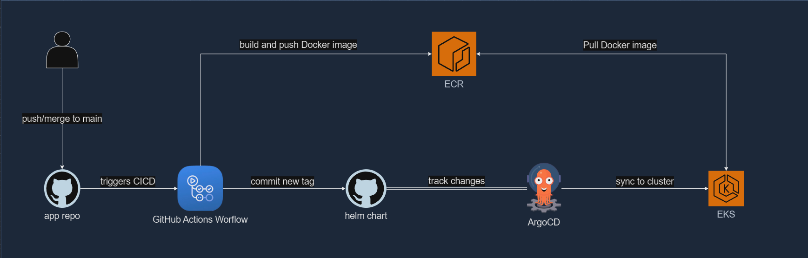

# This repository contains sample Python REST API application, dockerfile, helm charts and GitHub Actions configuration file for [ParcelLab SRE challenge](https://github.com/parcelLab/challenge-site-reliability-engineer)

## How to deploy | CICD

1. PR merge (push event) to `main` branch's `greet-api` folder triggers GitHub Actions workflow (.github/workflows/build-greet-api.yaml)
2. GHA builds new image, pushes it to ECR, and commits it's COMMIT SHA as new tag to the application's helm chart values.yaml file
3. ArgoCD syncs that change to the claster
4. Kubernetes pulls new image from the ECR

## Repo structure
```
├── .github
│   └── workflows
├── greet-api
├── kubernetes
│   └── helm
└── terraform
```

## Infrastructure
```
terraform/
├── cloudflare.tf
├── ecr.tf
├── eks.tf
├── github.oidc.tf
├── iam.sa_roles.tf
├── main.tf
├── values.tfvars
└── vpc.tf
```
I build infrastructure on AWS from scratch using Terraform. It deploys the following:
* a VPC with public subnets for EKS, 
* EKS itself,
* ECR
* OIDC for GitHub
* Necessary IAM roles and policies

Apart from that, Cloudflare is used as a DNS service, and GitHub Action - as a CI/CD tool (in conjunction with ArgoCD)

`values.tfvars` file contains values for environment variables.
Terraform can be applied by using the command `terraform apply -var-file values.tfvars`

## Helm Charts
```
kubernetes/
└── helm
    ├── apps
    │   └── greet-api
    └── tools
        ├── argo-apps
        ├── argocd
        ├── cert-manager
        ├── external-secrets
        └── nginx-ingress
```
`kubernetes/helm` folder contains two more folders:
* `apps` for applications charts
1. `greet-api` - REST API application, divided in two deployments according to the task, each with it's own service and ingress for two different customers to use.
* `tools` for infrastructure charts
1. `argo-apps` - helm chart that contains collection of ArgoCD's custom Application resources, [App of Apps](https://argo-cd.readthedocs.io/en/stable/operator-manual/cluster-bootstrapping/).
2. `argocd` - [ArgoCD](https://argo-cd.readthedocs.io/en/stable/) helm chart, GitOps CD tool.
3. `cert-manager` - [Cert Manager](https://cert-manager.io/) helm chart, used to provision certificates for `Ingress` resources.
4. `external-secrets` - [External Secrets Operator](https://external-secrets.io/latest/) helm chart, used to retrieve secrets from AWS Secrets Manager and provision kubernetes `Secret` resource.
5. `nginx-ingress` - [NGINX Ingress Controller](https://docs.nginx.com/nginx-ingress-controller/) helm chart, used for ingress implementation and to provision AWS NLB.
